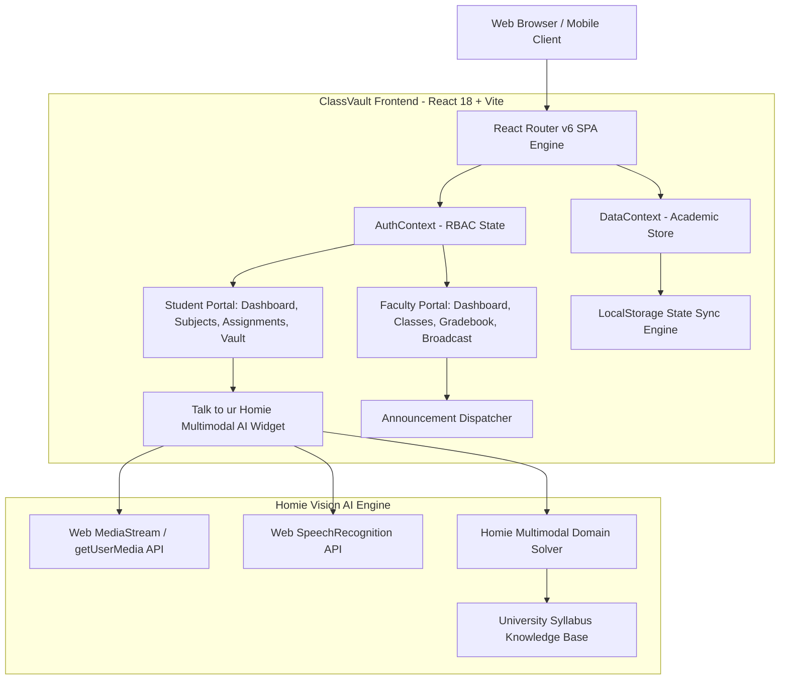
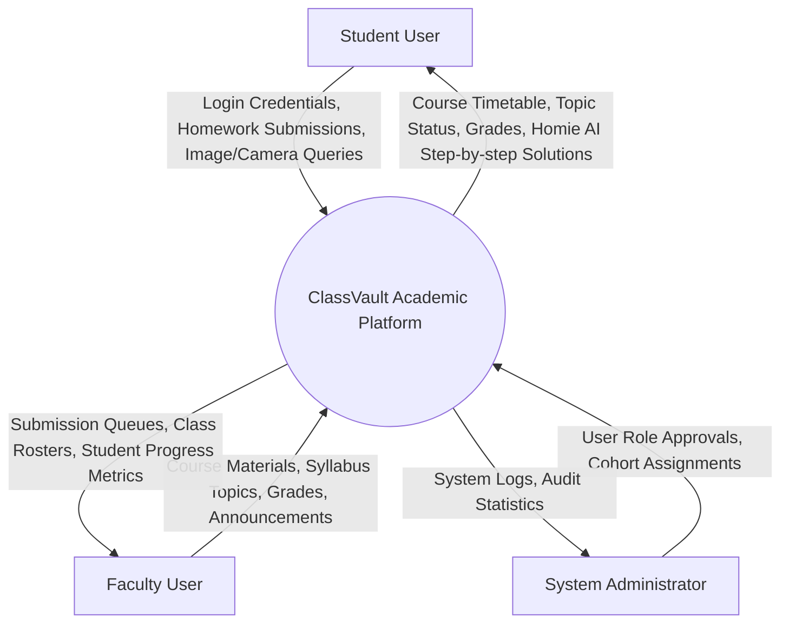
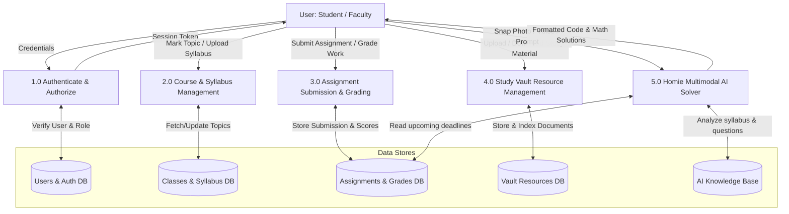

# ClassVault: Academic Learning Management & Multimodal AI System
## Comprehensive Project Context & Software Engineering Specification Document

> **Author**: Ajay Sathish & Team  
> **Course / Degree**: B.E. / B.Tech Computer Science & Engineering  
> **Project Name**: ClassVault  
> **Live Deployment**: https://iajaysathish31-bit.github.io/classvault/  
> **Repository**: https://github.com/iajaysathish31-bit/classvault  
> **Core Tech Stack**: React 18, Vite 5, Tailwind CSS 3, Lucide React, LocalStorage Persistent Store, Web MediaStream API (Camera), Web Speech Recognition API (Voice), Multimodal Vision AI Engine.

---

## Table of Contents
1. [Executive Summary & Problem Statement](#1-executive-summary--problem-statement)
2. [System Architecture & Tech Stack](#2-system-architecture--tech-stack)
3. [Software Engineering: Input Design](#3-software-engineering-input-design)
4. [Software Engineering: Output Design](#4-software-engineering-output-design)
5. [Data Flow Diagrams (DFD Level 0 & Level 1)](#5-data-flow-diagrams-dfd-level-0--level-1)
6. [Entity Relationship (ER) Schema & Database Tables](#6-entity-relationship-er-schema--database-tables)
7. [Core Functional Modules Breakdown](#7-core-functional-modules-breakdown)
8. [Multimodal Vision AI ("Talk to ur Homie") Engine](#8-multimodal-vision-ai-talk-to-ur-homie-engine)
9. [Project Directory & File Structure](#9-project-directory--file-structure)

---

## 1. Executive Summary & Problem Statement

### 1.1 Problem Statement
In higher education institutions, students and faculty often face fragmented workflows across separate, disconnected portals for attendance, course syllabi, assignments, announcements, and study material. Furthermore, students struggle to get immediate, step-by-step guidance when solving complex engineering problems outside classroom hours, particularly for technical subjects like Software Engineering, Atomic Physics, Research Methodology, and IoT Microcontrollers.

### 1.2 Proposed Solution: ClassVault
**ClassVault** is a unified, role-based Academic Management and Learning Hub with an embedded **Multimodal Academic AI Companion ("Talk to ur Homie")**. It supports:
- **Role-Based Access Control (RBAC)**: Distinct, isolated experiences for **Students**, **Faculty/Instructors**, and **Administrators**.
- **Interactive Syllabus & Topic Tracker**: Real-time tracking of completed vs. pending syllabus units with direct AI tutoring.
- **Multimodal AI Companion ("Talk to ur Homie")**:
  - Image attachments (camera snapshots or photo uploads) of homework diagrams, circuit boards, and formulas.
  - Live webcam viewfinder for desktop students to snap physical notebooks.
  - Voice speech-to-text dictation.
  - Domain-specific syllabus solver across university courses.
- **Assignment Submissions & Digital Gradebook**: File upload simulation, deadline countdowns, rubric evaluations, and letter grading.
- **Class Resource Vault**: Central repository for lecture slides, PDFs, code files, and lab manuals.

---

## 2. System Architecture & Tech Stack



### Tech Stack Details:
- **Frontend Framework**: React 18.3.1 (Component-based Functional Architecture with Hooks)
- **Bundler & Dev Server**: Vite 5.4 (Hot Module Replacement, Tree Shaking)
- **Styling**: Tailwind CSS 3.4 (Modern Indigo, Midnight Slate, Crisp White, Amber Accents)
- **Routing**: React Router DOM 6.26 (Nested Routes, Protected Route Wrappers)
- **Icons**: Lucide React 0.417
- **Browser APIs**: MediaDevices API (`getUserMedia`), FileReader API (Base64 encoding), Web Speech API (`webkitSpeechRecognition`)
- **Hosting & CI/CD**: GitHub Pages with automated GitHub Actions Workflow (`deploy.yml`)

---

## 3. Software Engineering: Input Design

Input design specifies how data enters ClassVault, ensuring data integrity, validation, and ease of use.

### 3.1 Input Form Specifications & Validation Rules

| Form / Input Module | Input Fields | UI Element Type | Validation & Constraints |
|---|---|---|---|
| **User Authentication (Login)** | 1. Email Address<br>2. Password<br>3. Selected Role | - Text input (`type="email"`)<br>- Password with reveal toggle<br>- Radio / Dropdown selector | - Valid university email format (`@univ.edu` or valid email)<br>- Minimum 6 characters<br>- Role matches credentials |
| **User Registration (Signup)** | 1. Full Name<br>2. University Email<br>3. Student ID / Faculty ID<br>4. Department<br>5. Password & Confirm | - Text fields<br>- Department dropdown<br>- Password inputs | - Name: Alpha only, min 2 chars<br>- Unique ID format (`24CSC...`)<br>- Password match check |
| **Assignment Submission** | 1. Assignment ID (hidden)<br>2. Upload Document / File<br>3. Student Notes / Remarks | - File input (`accept=".pdf,.zip,.py,.cpp,.docx"`)<br>- Multi-line textarea | - File required<br>- Max file size limit (25 MB simulated)<br>- Sanitized text notes |
| **Faculty Grade Entry** | 1. Student ID<br>2. Numerical Score (0-100)<br>3. Letter Grade<br>4. Written Feedback | - Number input (`min="0" max="100"`)<br>- Auto-calculated select<br>- Feedback textarea | - Score must be between 0 and 100<br>- Non-empty constructive feedback |
| **Faculty Course / Material Creation** | 1. Course Code<br>2. Subject Name<br>3. Topic Units<br>4. Material Type & File URL | - Form inputs<br>- Dynamic topic list builder<br>- Select dropdown | - Course code pattern (`24[A-Z]{3}[0-9][A-Z][0-9]{3}`)<br>- Title cannot be empty |
| **Faculty Broadcast Announcement** | 1. Target Cohort<br>2. Priority Level (Normal/Urgent)<br>3. Announcement Title<br>4. Message Body | - Class multiselect<br>- Priority toggle pills<br>- Text inputs | - Minimum 5 character body<br>- Target class must be selected |

### 3.2 Multimodal Inputs (AI Companion "Talk to ur Homie")
1. **Camera Snapshot Input**:
   - Mobile: `<input type="file" capture="environment" accept="image/*" />` triggers high-resolution rear device camera.
   - Desktop: `navigator.mediaDevices.getUserMedia({ video: { facingMode: 'user' } })` streams real-time video into a custom HTML `<video>` viewfinder with canvas shutter snapshot.
2. **File Attachment Input**:
   - File picker supporting JPG, PNG, WEBP, and PDF images.
   - Encoded via `FileReader.readAsDataURL` to Base64 payload.
3. **Voice Speech-to-Text Input**:
   - Interactive microphone button utilizing `SpeechRecognition` / `webkitSpeechRecognition`.
   - Continuous audio streaming translated to text input field in real time.

---

## 4. Software Engineering: Output Design

Output design governs how information is delivered to users to maximize readability, decision-making efficiency, and user satisfaction.

### 4.1 Output Screens & Displays

| Screen / Output View | Target User | Information Displayed | Output Format |
|---|---|---|---|
| **Student Study Hub (Dashboard)** | Student | - Welcome banner with streak count<br>- 4 Enrolled Cohort Cards<br>- Syllabus Progress Percentage<br>- Upcoming Lecture Timetable<br>- Study Scratchpad | Responsive Web Card Grid, Progress Rings, Real-time Countdown Pills |
| **Faculty Analytics Dashboard** | Faculty | - Total Active Cohorts<br>- Aggregate Class Attendance<br>- Submissions Awaiting Grading<br>- Course Progress Metrics | KPI Stat Cards, Cohort Progress Bars, Submission Badges |
| **Syllabus Tracker & Topic Review** | Student | - Numbered Unit Modules<br>- Topic Description & Reading Materials<br>- "Reviewed" / "Pending" status<br>- AI Topic Explainer button | Expandable Accordions, Status Tags, Direct "Ask Homie" Action |
| **Assignment Deliverables Matrix** | Student | - To-Do vs Submitted vs Graded tabs<br>- Due date & hours remaining<br>- Graded score & Teacher remarks | Filterable Card List, Color-coded Alert Pills (Red = <48h), Grade Badges |
| **Faculty Digital Gradebook** | Faculty | - Student Roster Table<br>- Submission Date & File Link<br>- Numerical Grade & Letter Grade<br>- Evaluation Modal | Tabular Data Grid, Status Filters, Inline Score Editing |
| **Study Vault Repository** | Both | - Course Folders<br>- File Type Badges (PDF, Code, Slides)<br>- Upload Date & Faculty Uploader<br>- Download Action | Document Explorer, Search Filter, Category Pills |
| **Homie AI Solution Output** | Student | - Mathematical KaTeX LaTeX formatting<br>- Syntax-highlighted code blocks with Copy Button<br>- Step-by-step reasoning steps<br>- Interactive multiple-choice quizzes | Markdown Chat Bubbles, Code Windows, Quiz Choice Buttons |

---

## 5. Data Flow Diagrams (DFD Level 0 & Level 1)

### 5.1 Level 0 DFD (Context Diagram)



### 5.2 Level 1 DFD (Decomposed System Processes)



---

## 6. Entity Relationship (ER) Schema & Database Tables

### 6.1 Database Entities and Cardinalities
- `USER` (1) --- (M) `ENROLLMENT` --- (M) `CLASS`
- `CLASS` (1) --- (M) `SYLLABUS_TOPIC`
- `CLASS` (1) --- (M) `ASSIGNMENT`
- `ASSIGNMENT` (1) --- (M) `SUBMISSION` --- (1) `USER` (Student)
- `CLASS` (1) --- (M) `VAULT_RESOURCE`

### 6.2 Data Dictionaries (Tables)

#### Table 1: `USERS`
| Column | Type | Constraints | Description |
|---|---|---|---|
| `id` | VARCHAR(50) | PRIMARY KEY | Unique user identifier (e.g. `stu-001`, `fac-001`) |
| `name` | VARCHAR(100) | NOT NULL | User's full display name |
| `email` | VARCHAR(150) | UNIQUE, NOT NULL | Institutional email address |
| `role` | ENUM | NOT NULL | `'student'`, `'faculty'`, `'admin'` |
| `department` | VARCHAR(100) | NOT NULL | Department name (e.g., Computer Science) |
| `avatar` | VARCHAR(255) | NULL | Avatar icon or image URL |

#### Table 2: `CLASSES`
| Column | Type | Constraints | Description |
|---|---|---|---|
| `class_id` | VARCHAR(50) | PRIMARY KEY | Unique class code (e.g., `24CSC2T351`) |
| `subject` | VARCHAR(150) | NOT NULL | Full course name (e.g., Software Engineering) |
| `instructor_id` | VARCHAR(50) | FOREIGN KEY -> USERS(id) | Assigned professor ID |
| `instructor_name` | VARCHAR(100) | NOT NULL | Professor display name |
| `schedule` | VARCHAR(100) | NOT NULL | Class days and time slots |
| `room` | VARCHAR(50) | NOT NULL | Lecture hall / lab location |

#### Table 3: `SYLLABUS_TOPICS`
| Column | Type | Constraints | Description |
|---|---|---|---|
| `topic_id` | VARCHAR(50) | PRIMARY KEY | Topic identifier (e.g., `TOPIC-SE-01`) |
| `class_id` | VARCHAR(50) | FOREIGN KEY -> CLASSES(class_id) | Parent course code |
| `topic_name` | VARCHAR(150) | NOT NULL | Module name (e.g., SOLID Principles & Clean Architecture) |
| `content` | TEXT | NOT NULL | Detailed unit syllabus description |

#### Table 4: `ASSIGNMENTS`
| Column | Type | Constraints | Description |
|---|---|---|---|
| `id` | INT | PRIMARY KEY, AUTO_INCREMENT | Assignment ID |
| `subject` | VARCHAR(50) | FOREIGN KEY -> CLASSES(class_id) | Associated course code |
| `title` | VARCHAR(200) | NOT NULL | Assignment task title |
| `description` | TEXT | NOT NULL | Instructions, problem statement, parameters |
| `dueDate` | VARCHAR(50) | NOT NULL | Submission deadline |
| `dueDays` | INT | NOT NULL | Calculated days remaining |
| `points` | INT | DEFAULT 100 | Maximum grade points |
| `rubric` | TEXT | NULL | Scoring criteria breakdown |

#### Table 5: `SUBMISSIONS`
| Column | Type | Constraints | Description |
|---|---|---|---|
| `submission_id` | INT | PRIMARY KEY, AUTO_INCREMENT | Unique submission record |
| `assignment_id` | INT | FOREIGN KEY -> ASSIGNMENTS(id) | Targeted assignment |
| `student_id` | VARCHAR(50) | FOREIGN KEY -> USERS(id) | Submitting student |
| `submittedAt` | VARCHAR(50) | NOT NULL | Timestamp of file submission |
| `fileName` | VARCHAR(255) | NOT NULL | Uploaded document file name |
| `status` | ENUM | NOT NULL | `'pending'`, `'submitted'`, `'graded'` |
| `grade` | VARCHAR(20) | NULL | Score (e.g., `98/100`) |
| `letterGrade` | VARCHAR(5) | NULL | Letter grade (`A+`, `A`, `B`, etc.) |
| `feedback` | TEXT | NULL | Faculty evaluation comments |

---

## 7. Core Functional Modules Breakdown

### 7.1 Student Portal (`/student/*`)
1. **Student Dashboard (`StudentDashboard.jsx`)**: Comprehensive overview featuring lecture timetable, progress statistics, recent activity, and quick access buttons.
2. **Subject Syllabus Tracker (`StudentClasses.jsx`)**: Syllabus breakdown for enrolled subjects, topic completion checkmarks, and instant "Ask Homie" query triggers.
3. **Assignments Hub (`StudentAssignments.jsx`)**: Real-time deliverable matrix with deadline alerts, document upload simulation, and graded feedback view.
4. **Study Vault (`StudentVault.jsx`)**: Course material explorer with filters for past exam papers, lecture notes, lab manuals, and code repositories.

### 7.2 Faculty Portal (`/teacher/*`)
1. **Faculty Dashboard (`FacultyDashboard.jsx`)**: Active cohort monitoring, grading queue, and attendance overview.
2. **Course & Syllabus Manager (`FacultyClasses.jsx`)**: Curriculum management, unit additions, and attendance tracking.
3. **Grading Suite (`FacultyGradebook.jsx`)**: Student submission assessment, rubric evaluations, score assignments, and feedback broadcasting.
4. **Material Publisher (`FacultyMaterials.jsx`)**: Multi-category file repository publisher for students.
5. **Class Broadcast (`FacultyBroadcast.jsx`)**: Announcement system for urgent notices and assignments.

---

## 8. Multimodal Vision AI ("Talk to ur Homie") Engine

### 8.1 Key Capabilities
- **ChatGPT-Style Floating Drawer**: Always accessible via an executive navy/indigo launcher button.
- **Multimodal Visual Inputs**:
  - Live Desktop Camera Viewfinder (`getUserMedia`).
  - Mobile Native Camera (`capture="environment"`).
  - Drag-and-drop Image / Document Upload (`FileReader` Base64 encoding).
- **Voice Dictation**: Web Speech Recognition with real-time waveform pulse.
- **Domain Knowledge Engine (`homieAIEngine.js`)**:
  - `24CSC2T351` (Software Engineering): MVC vs Microservices, SOLID, Agile Scrum, Sprint planning, Git workflows.
  - `24PHY2T351` (Atomic Physics): Landé $g$-factor derivations ($g = 1 + \frac{j(j+1) + s(s+1) - l(l+1)}{2j(j+1)}$), Zeeman effect, Liquid drop model.
  - `24CPL2T451` (Research Methodology): Systematic Literature Reviews (SLR), Null hypotheses, Type I/II errors, APA 7th referencing.
  - `24ELE2T351` (Microcontrollers & IoT): ESP32 C/C++ firmware, I2C / SPI / UART protocols, MQTT telemetry.
- **Urgent Deadline Radar**: Real-time scan of pending tasks due within 48 hours with automated blueprints for full marks.

---

## 9. Project Directory & File Structure

```
classvault/
├── public/
│   ├── 404.html                     # SPA routing fallback for GitHub Pages
│   ├── _redirects                   # Redirect rules
│   └── vijay_anime_mascot.png       # Anime mascot doing signature chin swipe
├── src/
│   ├── assets/
│   │   └── vijay_anime_mascot.png   # Bundled mascot image
│   ├── components/
│   │   ├── AICompanionWidget.jsx    # ChatGPT-style Multimodal AI Drawer & Mascot
│   │   └── Sidebar.jsx              # Reusable navigation sidebar
│   ├── context/
│   │   ├── AuthContext.jsx          # Role-based user authentication & state
│   │   └── DataContext.jsx          # Classes, syllabus, and assignment data store
│   ├── layouts/
│   │   ├── StudentLayout.jsx        # Student portal layout with clean navigation
│   │   └── TeacherLayout.jsx        # Faculty portal layout
│   ├── pages/
│   │   ├── Landing.jsx              # Public landing page with role select
│   │   ├── Login.jsx                # Institutional login portal
│   │   ├── Signup.jsx               # Student/faculty registration
│   │   ├── Profile.jsx              # User profile & academic credentials
│   │   ├── student/
│   │   │   ├── StudentDashboard.jsx # Student hub & timetable
│   │   │   ├── StudentClasses.jsx   # Enrolled classes & syllabus topic reviews
│   │   │   ├── StudentAssignments.jsx # Assignment submissions & rubric review
│   │   └── teacher/
│   │       ├── FacultyDashboard.jsx # Teacher management overview
│   │       ├── FacultyClasses.jsx   # Syllabus management
│   │       ├── FacultyGradebook.jsx # Student grading & rubric suite
│   │       ├── FacultyMaterials.jsx # Vault content publisher
│   │       └── FacultyBroadcast.jsx # Class announcement dispatcher
│   ├── utils/
│   │   ├── homieAIEngine.js         # Multimodal AI vision solver & syllabus engine
│   │   └── aiCharacterEngine.js     # Legacy persona mapper
│   ├── App.jsx                      # Route configuration & route guards
│   ├── index.css                    # Tailwind CSS imports & animations
│   └── main.jsx                     # Vite entry point
├── package.json
├── tailwind.config.js
└── vite.config.js
```
